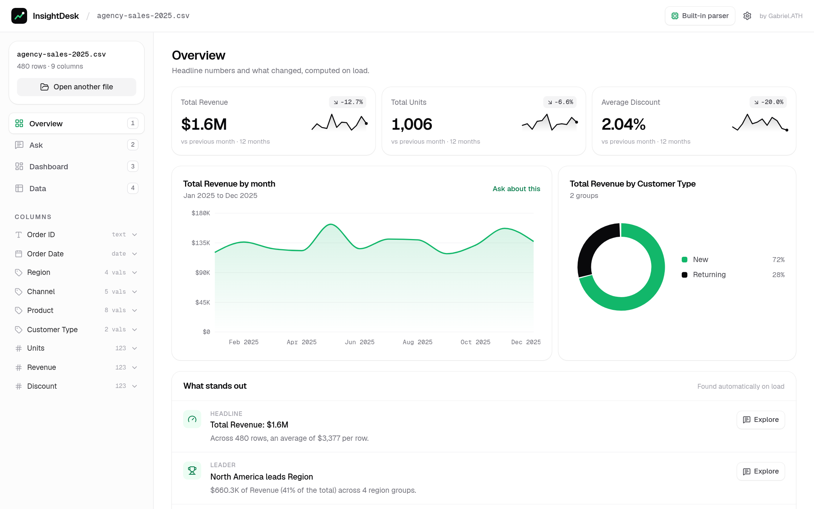
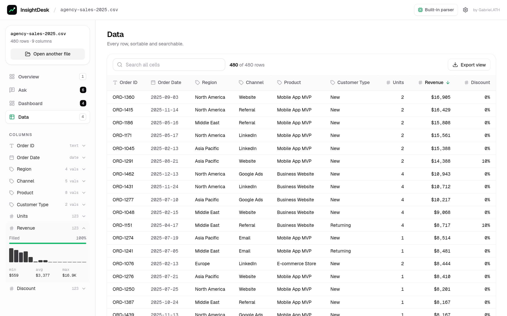
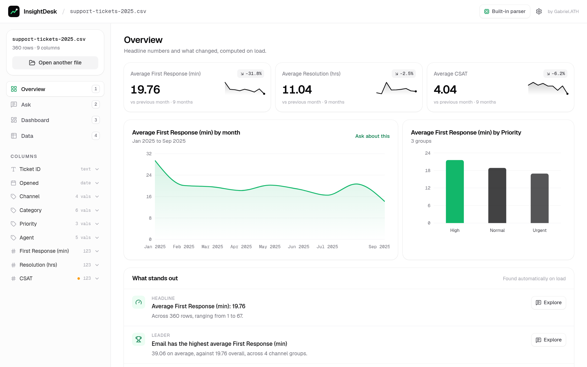
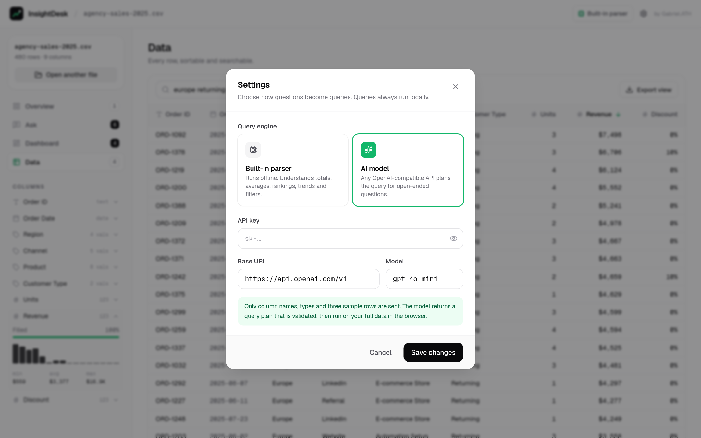

<div align="center">


# InsightDesk

### Your spreadsheet already knows the answer. Just ask it.

Drop in a CSV from your store, CRM, ad account or help desk. InsightDesk profiles every column, shows what changed, answers plain-English questions with charts and lets you pin the good ones to a one-page dashboard. All of it runs in your browser.



</div>

---

## Why

Most business questions are a pivot table away, but building one takes time and a bit of spreadsheet skill. InsightDesk skips that step: open the file, read the headline numbers, then ask “top 5 products by revenue in Europe” and get a chart and a sentence back.

## Features

**Overview, the moment a file opens**
- KPI cards for the main numeric columns with a monthly sparkline and the change versus the previous month.
- Monthly trend of the main metric and a breakdown by the most useful category.
- “What stands out”: leaders, growth, unusual values (more than 3 standard deviations out) and missing data, each with an **Explore** button that turns it into a question.
- Sensible maths: money and counts are summed, while durations, scores, ratings and percentages are averaged.

**Ask in plain English**
- Totals, averages, counts, unique counts, min and max; breakdowns by any column; time buckets (day, week, month, quarter, year); top/bottom N; filters such as “in Europe”, “not Email”, “over 1000” or “in March”.
- Every answer comes with a one-line summary, a chart (bar, line, donut or big number) and a table view with share bars.
- Optional **AI mode** with any OpenAI-compatible API for open-ended phrasing. The model only sees column names, types and three sample rows, and returns a JSON query plan that is validated with Zod and checked against your real columns. No generated code is executed.

**Dashboard and exports**
- Pin answers to a two-column dashboard, print it, or export a Markdown report with the highlights and tables.
- Copy any result as CSV.

**Data view**
- Every row in a paged table: click a header to sort by type (numbers numerically, dates chronologically, blanks last).
- Multi-word search across all cells (“europe returning”) and **Export view** to CSV.
- Empty cells are flagged so data gaps are obvious.

**Column profiles**
- Expand any column in the sidebar to see how full it is, a histogram with min/avg/max for numbers, top values for categories or the date range.

**Comfort**
- Keyboard shortcuts: `1`–`4` switch sections, `/` jumps to the question box.
- Three synthetic sample datasets (agency sales, marketing leads, help-desk tickets) so it can be tried without a file.

## Screenshots

| Landing | Ask |
|---|---|
|  |  |

| Dashboard | Data |
|---|---|
|  |  |

| Help-desk sample overview | Settings |
|---|---|
|  |  |

## How a question is answered

```
question ──▶ built-in parser ─┐
                               ├─▶ QueryPlan (validated) ─▶ run on every row in the browser ─▶ summary + chart
question ──▶ AI model (schema) ┘
```

A `QueryPlan` is a small declarative object (metric, group-by, filters, sort, limit, chart). It is never evaluated as code.

## Tech stack

- Next.js 16 (App Router, static export), React 19, TypeScript
- Tailwind CSS 4 with a custom green/black design system, Geist and Geist Mono
- Recharts, PapaParse, Zod, Radix Dialog, react-dropzone, sonner, lucide-react
- Vitest for parsing, profiling, the language engine, queries, overview maths, table sorting/search and AI plan validation
- GitHub Actions: type-check, tests and build on every push

## Run locally

Requires Node.js 20.9 or newer.

```bash
git clone https://github.com/gabrielolarinre74-pixel/insightdesk-ai.git
cd insightdesk-ai
npm install
npm run dev        # http://localhost:3000
```

Pick a sample dataset or drop in your own CSV. No key is needed: the built-in parser handles the questions above offline. For AI mode, open **Settings**, choose **AI model** and add your own key, base URL and model. The key stays in your browser.

```bash
npm run lint       # TypeScript
npm test           # Vitest
npm run build      # static site in out/
npx serve out      # preview the production build
```

`.env.example` documents the only build option (`BASE_PATH`). No secrets are required.

## Project structure

```
src/app/page.tsx            app shell: landing, sidebar, sections
src/components/             Overview, AnswerCard, ChartView, DataTable, ColumnList, Landing, SettingsDialog
src/lib/data/               CSV loading, profiling, language parser, query engine, insights, overview, table helpers
src/lib/ai.ts               OpenAI-compatible planner with Zod validation
tests/                      Vitest suites
```

## License

MIT. See [LICENSE](LICENSE).

---

Designed and built by **Gabriel Zion · Gabriel.ATH**. I build websites, apps and AI automation that help businesses grow. [Portfolio](https://gabrielzion-portfolio.vercel.app)
