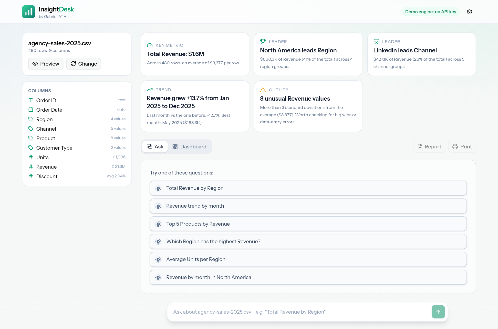
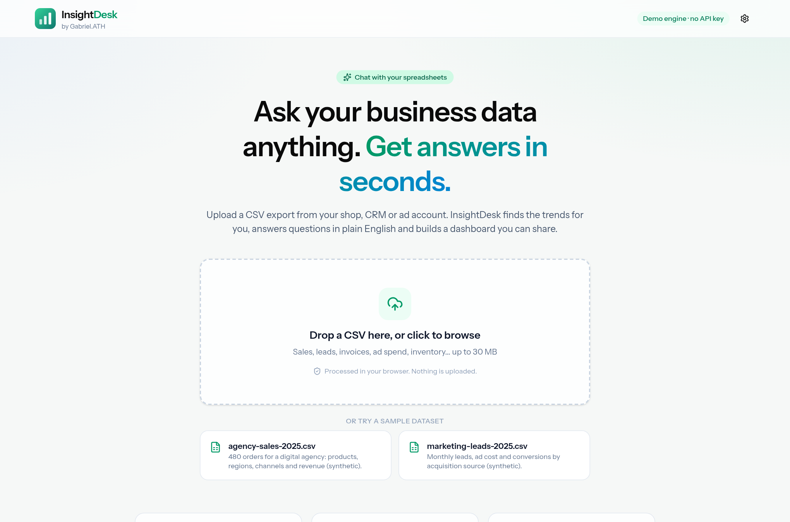
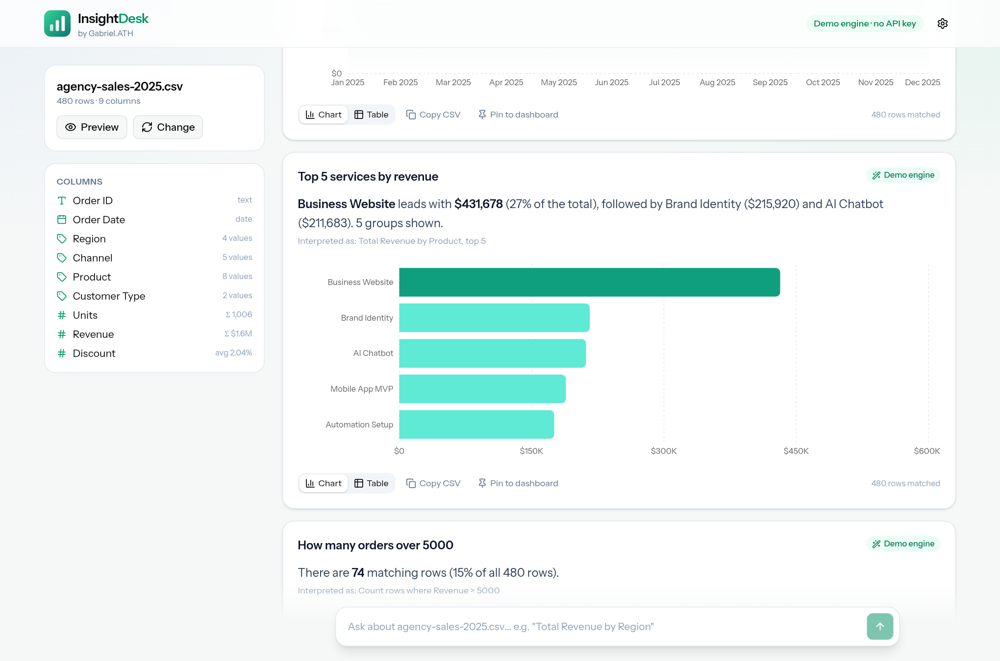
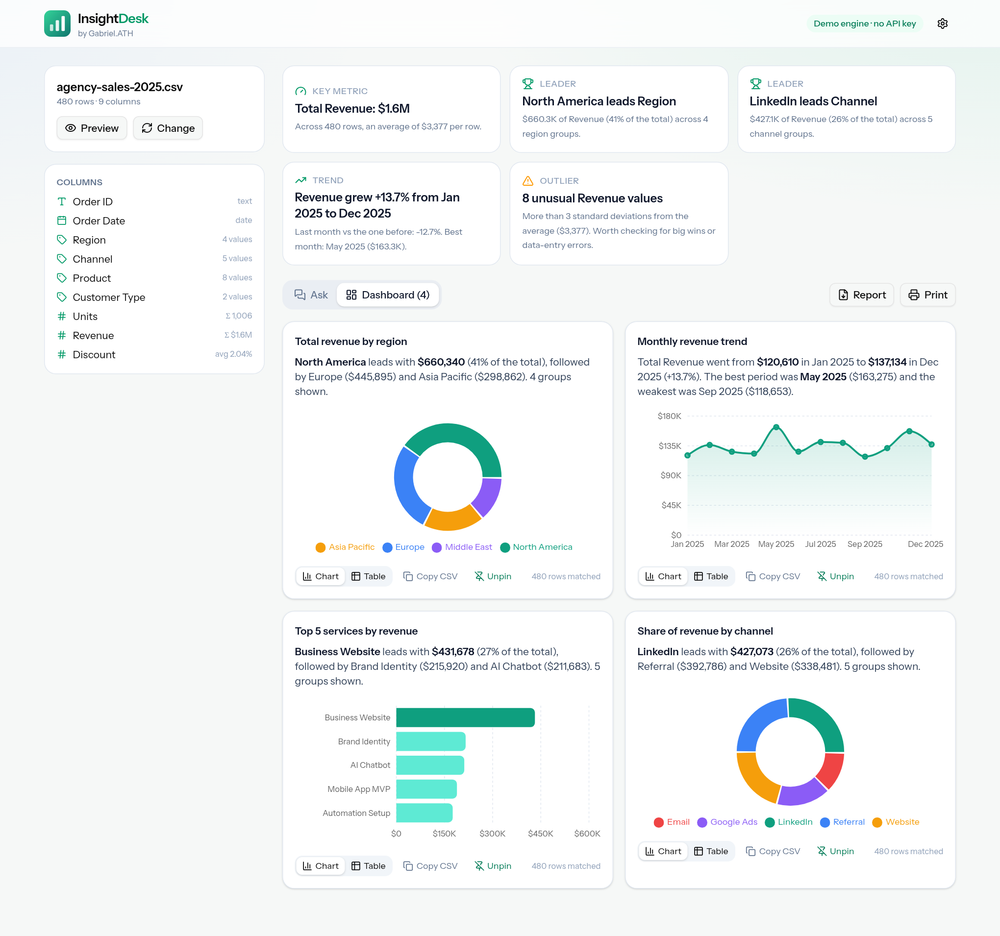
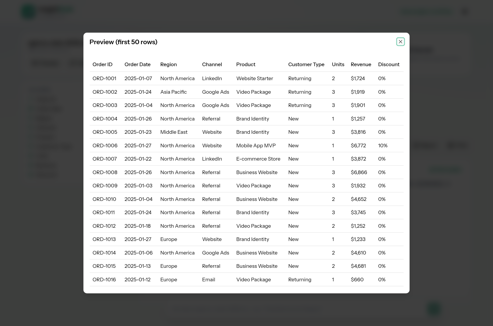

<div align="center">


# InsightDesk

**Chat with your business data. Upload a CSV, ask questions in plain English and get instant answers, charts, automatic insights and a dashboard you can share.**

[**Live demo**](https://gabrielolarinre74-pixel.github.io/insightdesk-ai/) · runs in the browser with sample datasets, no account and no API key



</div>

## The problem it solves

Most small businesses already have the data they need: exports from their shop, CRM, invoicing tool or ad account. What they don't have is an analyst. Answering "which service brings in the most money?" or "are sales actually growing?" means pivot tables, formulas and time nobody has.

InsightDesk turns that CSV into answers:

- Drop in a file and it **profiles every column** and surfaces the headline numbers, top performers, growth trend, unusual values and data-quality gaps on its own.
- Ask questions the way you'd ask a colleague: *"top 5 services by revenue"*, *"monthly revenue trend"*, *"how many orders over 5000"*, *"average revenue in Europe"*.
- Pin the answers that matter to a **dashboard**, then print it to PDF or download a Markdown report for your team or client.

## Features

**Automatic insights**
- Column profiling with type detection (number, currency, percentage, date, category, text)
- Insight cards for the key metric, leading segments, period-over-period trend, statistical outliers and missing values
- Starter questions generated from your own columns. Click any insight to drill into it.

**Ask in plain English**
- Built-in language engine that works offline: totals, averages, counts, min/max, unique counts, top/bottom N, grouping, filters (`in Europe`, `over 5000`, `in March`, `returning customers`) and day/week/month/quarter/year trends
- Understands synonyms and plurals (*services → Product*, *sales → Revenue*, *clients → Customer*)
- Every answer shows a one-line summary, an "Interpreted as" line so you can check what was calculated, and how many rows matched
- Optional **AI mode** for open-ended questions with any OpenAI-compatible API (OpenAI, Groq, OpenRouter, Together, local models…)

**Charts and dashboard**
- Picks the right visual automatically: KPI number, trend line, donut for shares, bar chart for rankings
- Switch between chart and table, copy any result as CSV
- Pin answers to a dashboard, print it, or export a Markdown report with the insights and result tables

**Private and safe by design**
- Files are parsed and queried **entirely in the browser**. Nothing is uploaded.
- In AI mode the model only receives the column names, types and 3 sample rows. It returns a small JSON query plan, which is validated with Zod and checked against your real columns before running locally on the full dataset. No generated code is ever executed.
- The API key is stored only in your browser's localStorage, and non-HTTPS endpoints are rejected (except localhost)
- File limits (30 MB / 200,000 rows), question length limits and friendly errors for malformed CSVs

## Screenshots

| Upload | Ask a question |
|---|---|
|  |  |

| Dashboard | Data preview |
|---|---|
|  |  |

> The two sample datasets (`agency-sales-2025.csv`, `marketing-leads-2025.csv`) are synthetic and generated in code. They are not real business data.

## How it works

```
CSV ─▶ parse (PapaParse) ─▶ profile columns ─▶ automatic insights
                                   │
question ─▶ demo engine (offline parser) ─┐
        └─▶ AI engine (schema + 3 rows) ──┴▶ QueryPlan (validated) ─▶ run locally ─▶ answer + chart
```

A `QueryPlan` is a small, declarative description of the calculation:

```json
{ "metric": { "op": "sum", "column": "Revenue" },
  "groupBy": { "column": "Product" },
  "filters": [{ "column": "Region", "op": "=", "value": "Europe" }],
  "sort": "desc", "limit": 5 }
```

Because the plan is data rather than code, it can be validated, explained back to the user and executed safely.

## Tech stack

- **Next.js 16** (static export) · **React 19** · **TypeScript**
- **Tailwind CSS 4** · Radix UI primitives · lucide icons · Sonner toasts
- **Recharts** for charts · **PapaParse** for CSV parsing · **Zod** for validating AI output
- **Vitest** for the engine test suite
- GitHub Actions → GitHub Pages

## Getting started

```bash
git clone https://github.com/gabrielolarinre74-pixel/insightdesk-ai.git
cd insightdesk-ai
npm install
npm run dev        # http://localhost:3000
```

```bash
npm test           # engine tests (parsing, profiling, language engine, queries, AI plan validation)
npm run lint       # type-check
npm run build      # static site in ./out
```

No environment variables are required. See [.env.example](.env.example). To use AI mode, open **Settings** in the app and add your own API key, base URL and model.

### Deploying

The included workflow (`.github/workflows/deploy.yml`) runs the tests, builds with the right base path and publishes to GitHub Pages on every push to `main`. Enable **Settings → Pages → Source: GitHub Actions** on your repository.

## Project structure

```
src/
  app/                 page + layout
  components/          upload area, answer card, charts, settings, preview
  lib/data/
    parse.ts           number / currency / percent / date parsing
    profile.ts         column type detection and statistics
    nl.ts              offline question → QueryPlan parser
    query.ts           plan validation and execution
    answer.ts          plain-English narration of results
    insights.ts        automatic insights and suggested questions
    load.ts            CSV loading with size and row limits
    samples.ts         synthetic demo datasets
  lib/ai.ts            OpenAI-compatible planner with Zod validation
tests/                 Vitest suite
```

## License

MIT. See [LICENSE](LICENSE).

---

Built by **Gabriel Zion · Gabriel.ATH**. I build websites, apps and AI automation that help businesses grow. [Portfolio](https://gabrielzion-portfolio.vercel.app)
